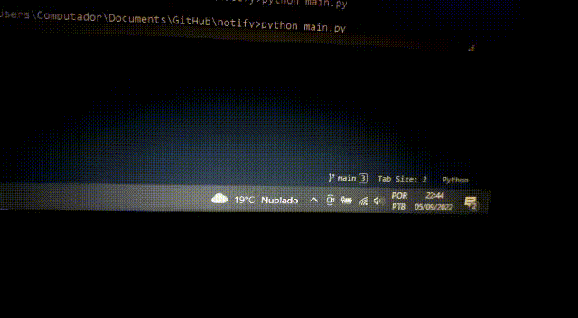
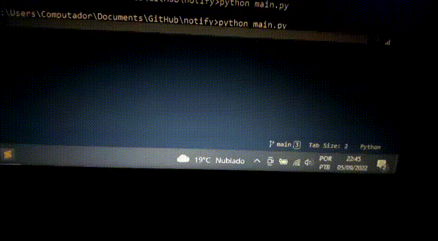

# notify
>Python windows notify using PySimpleGUI

**Tabela Guia**

[TOCM]

[TOC]

# O que o projeto faz ?
>O projeto exibe uma janela de notificação no canto inferior direito da tela.

# Por que o projeto é útil ?
>Será útil para fazer outros projetos, tais como conversa entre clientes em LAN, alarme para pomodoro, e etc. Além de servir como aprendizado.

# Como os usuários podem começar a usar o projeto ?
>Basta instalar o pySimpleGUI. Caso queira instalar usando o requirements, use o comando: `pip install -r requirements.txt`

# Onde os usuários podem obter ajuda com seu projeto ?
>Na própria documentação do Python e PySimpleGUI tem muita informação, caso precise, pode entrar em contato.

# Código　

```python
#! as cores são informadas aqui, caso haja necessidade de alterar.
STATIC_BGC = {
	'info': '#017880',
	'error': '#cf0000',
	'normal': '#272628',
	'success': '#1e8f03',
	'warning': '#a13105',
}

#! os tempos de até a saída da janela, caso haja necessidade de alterar.
STATIC_OUT = {
	'blink': -1,
	'turbo': 0.5,
	'fastest': 1.5,
	'fast': 3,
	'normal': 5,
	'slow': 8,
	'slowly': 12,
	'sleep': 16,
}

#! parametros padrões
DEFAULT_PARAMS = {
	'title':'TITLE',
	'message':'MESSAGE',
	'type_bgc':'normal',
	'duration_seconds':2,
	'fade_in':True,
	'custom_bgc':False,
	'add_y':0,
	'out_type':'blink',
}
```

# Observações
>O argumento `add_y` é onde a janela irá aparecer, 0 é o padrão. Recomendo usar com Thread / Multiprocess, para executar uma em cima da outra, caso precise.
>O argumento `custom_bgc` é para passar uma cor específica que não esteja listada no código.
>O argumento `fade_in`  ativa o efeito de `alpha` da janela, ela vai sumindo no horizonte de acordo com o tempo especificado.

# Imagens
>
>